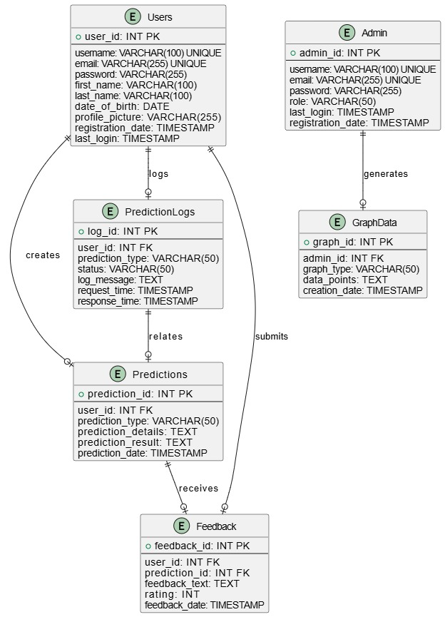
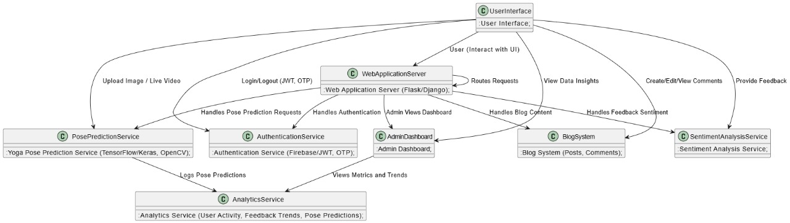

# Yoga Pose Prediction Project

## Table of Contents
1. [Introduction](#introduction)
2. [Features](#features)
3. [Technologies Used](#technologies-used)
4. [Dataset](#dataset)
5. [System Architecture](#system-architecture)
6. [Model Workflow](#model-workflow)
7. [Implementation Details](#implementation-details)
8. [Results](#results)
9. [Installation](#installation)
10. [Usage](#usage)
11. [Future Enhancements](#future-enhancements)
12. [Contributing](#contributing)

---

## 1. Introduction
The Yoga Pose Prediction Project is a machine learning-based application designed to predict yoga poses from images or live video feeds. It provides users with an intuitive way to learn and perfect their yoga poses. Additional features include authentication, role-based access for users and admins, real-time pose predictions, and personalized pose recommendations. The project also integrates sentiment analysis for feedback, a blog section, and resources related to yoga and wellness.

## 2. Features
The project offers the following features:

- **Authentication & Role-Based Access:** Secure login for users and admins with role-specific functionalities.
- **OTP-Based Password Recovery:** Secure account recovery using One-Time Passwords.
- **Yoga Pose Prediction:** Upload an image to predict a yoga pose.
- **Real-Time Pose Prediction:** Predicts at least 4-5 common yoga poses using a webcam.
- **Pose Search:** Search for a pose and access detailed tutorials.
- **Feedback Sentiment Analysis:** Analyzes user feedback to determine sentiment (positive, neutral, negative).
- **Blog Section:** Users can create, edit, and comment on yoga-related posts.
- **Pose Recommendations:** Suggests yoga poses based on user health benefits.
- **Admin Dashboard:** Visualizes metrics like user activity and feedback trends.

## 3. Technologies Used
### Backend
- **Python (Flask/Django)**
- **Node.js** (for specific components)
- **Firebase/Auth0** (for authentication and OTP recovery)

### Frontend
- **Bootstrap** (styling)
- **HTML5, CSS3, JavaScript**

### Machine Learning
- **TensorFlow/Keras** (model training for pose prediction)
- **OpenCV** (real-time pose detection via webcam)

### Database
- **MySQL/PostgreSQL** (relational data)
- **MongoDB** (unstructured blog content and feedback)

### Cloud Services
- **AWS** (deployment and storage)
- **Firebase** (real-time database and user authentication)

### Other Tools
- **Docker** (containerization)
- **GitHub Actions** (CI/CD)
- **Google Analytics** (user tracking)

## 4. Dataset
The dataset includes labeled images of various yoga poses, sourced from publicly available yoga datasets. The data is preprocessed to normalize image size and resolution. A sentiment analysis dataset is also used to evaluate user feedback tones.




## 5. System Architecture
The architecture consists of:

1. **Frontend:** Interactive UI for user interactions and predictions.
2. **Backend:** Handles logic, authentication, and model interactions.
3. **Database:** Stores user data, pose information, blogs, and feedback.
4. **Machine Learning Model:** Predicts yoga poses using trained CNNs.
5. **Cloud Infrastructure:** Supports deployment and scalability.




## 6. Model Workflow
1. **Data Collection:** Collect images of various yoga poses.
2. **Preprocessing:** Resize, normalize, and augment images for training.
3. **Model Training:** Use CNNs in TensorFlow/Keras.
4. **Pose Prediction:** Model predicts poses from images or live input.
5. **Real-Time Predictions:** OpenCV captures webcam frames for live prediction.

## 7. Implementation Details
- **Authentication:** OAuth2.0 and Firebase enable secure user logins.
- **OTP Recovery:** Sends secure OTPs for password recovery.
- **Yoga Pose Prediction:** Flask/Django serves predictions via API endpoints.
- **Real-Time Detection:** Webcam frames processed by OpenCV for predictions.
- **Blog Management:** Users create and comment on yoga blogs.
- **Sentiment Analysis:** NLP model evaluates feedback tones.

## 8. Results
- **Model Performance:**
  - Accuracy: XX%
  - Precision: XX%
  - Recall: XX%
  - F1-Score: XX%
- **Real-Time Predictions:** High accuracy with low latency for live inputs.
- **Feedback Sentiment Analysis:** Effective tone analysis with XX% accuracy.
- **User Engagement:** Increased interaction with blogs and pose resources.

## 9. Installation
### Steps to Run Locally
1. **Clone the Repository:**
   ```bash
   git clone https://github.com/your-username/yoga-pose-prediction.git
   ```
2. **Navigate to Directory:**
   ```bash
   cd yoga-pose-prediction
   ```
3. **Install Dependencies:**
   ```bash
   pip install -r requirements.txt
   ```
4. **Set Up the Database:**
   - Run migration scripts.
   - Configure environment variables for database and services.

5. **Start the Application:**
   ```bash
   python app.py
   ```

## 10. Usage
- **Login:** Navigate to `/login` for secure login.
- **Pose Prediction:** Access `/predict` to upload images for predictions.
- **Real-Time Prediction:** Use `/live-prediction` for webcam-based pose detection.
- **Feedback Submission:** Provide feedback at `/feedback` and view sentiment results.
- **Blogs:** Manage yoga-related blogs at `/blog`.

## 11. Future Enhancements
- Expand pose recognition capabilities.
- Integrate an AI-based yoga coach.
- Develop a mobile application.
- Add augmented reality (AR) for 3D pose visualization.

## 12. Contributing
1. Fork the repository.
2. Create a new branch for your changes.
3. Commit and push your changes.
4. Submit a pull request with a detailed description.

Refer to [CONTRIBUTING.md](./CONTRIBUTING.md) for more guidelines.
